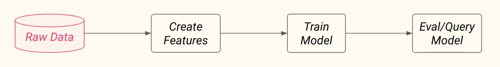
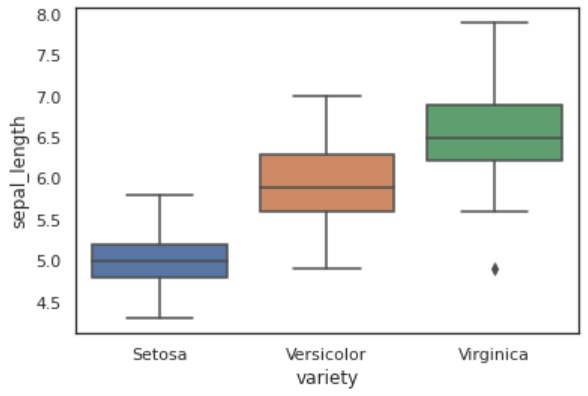
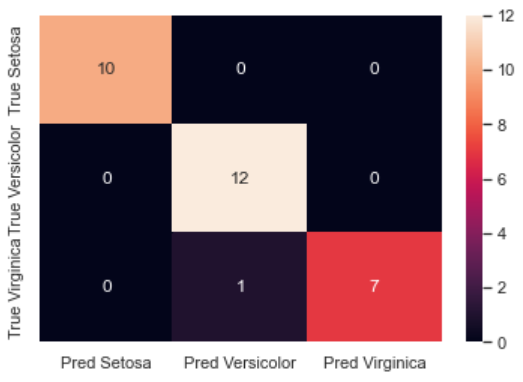
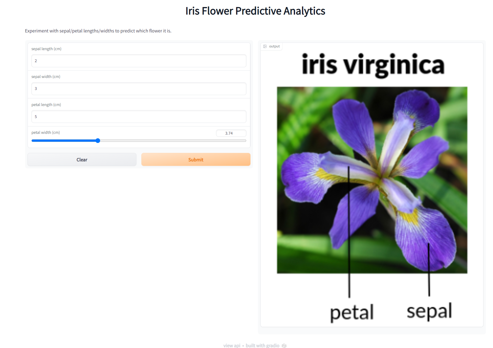

05/10/2022

# Lab 1 Serverless Machine Learning
#machinelearning #course #hopsworks #serverless #gradio

We're looking at lab 1 of the [Serverless-ML course](https://www.serverless-ml.org/) today. Make sure to check out their website and their [Github repository and give them a star!](https://github.com/featurestoreorg/serverless-ml-course) 

A link to my fork of the repo is [here](https://github.com/BenSnow6/serverless-ml-course/tree/main/src/01-module) if you wish to follow along with my notebooks!

## Introduction
Following on from Module 0 labs we are now going to look into deploying an actual machine learning product to the web! How exciting! :D

We are going to investigate the notorious Iris dataset and create several models to predict the variety of flower given a set of characteristics about flowers. This is a simple classification problem and we will use sklearn and pandas to create dataframes, split training and test sets, create a KNN model, evaluate this model, and then query the model! Visualisation with seaborn is used throughout.

The architecture of the end to end pipeline will look like this:
|  |
|:--:|
| <b>Fig 1. End to end machine learning pipeline for this first section of the lab.</b>|

As you can see, data flows from one end of the pipeline to the other. Data is ingested from a CSV file, processed to create useful features, and then used to train a KNN model. The model is then evaluated and deployed to a web application with Gradio. The web application is then used to query the model and get a prediction.

## Downloading and visualising the data
We start by reading in the data from a git-repo into a pd dataframe:
```python
iris_df = pd.read_csv("https://repo.hops.works/master/hopsworks-tutorials/data/iris.csv")
```
It's a good idea to look at data throughout a project, so take some time here to inspect the data we have just downloaded. Creating box plots of the classes vs different attributes is a good way to go. Maybe we can determine some rules ourselves that would help us make a prediction about the classes ourselves. If we can create a few simple rules in our head or spot pattern, it's very likely a machine learning model will be able to do the same!


|  |
|:--:|
| <b>Fig 2. Sepal length vs plant variety. It looks like there already some distinctions between each of the classes...</b>|


## Getting ready to fit a model
After looking at some data, let's split it into features and labels:
```python
features = iris_df[["sepal_length", "sepal_width", "petal_length", "petal_width"]]
labels = iris_df[["variety"]]
```
and from here, split into a train and a test set with sklearn:
```python
from sklearn.model_selection import train_test_split
X_train,X_test,y_train,y_test = train_test_split(features, labels, test_size=0.2)
```
Sometimes we have to transform our labels to numerical values (string to int or one hot encoding etc...) but thankfully, KNN models are able to use categorical variables as labels so we don't have to.

## Create a model and fit

We can now create a KNN classifier with sklearn and fit it to our training dataset:

```python
model = KNeighboursClassifier(n_neighbours=2) # 2 nearest neighbour classifier
model.fit(X_train, y_train.values.ravel()) # fit to training data (ravel allows for categorical labels)
```

## Create predictions on test data
We can now predict the classes of the test set and report back our findings:
```python
y_pred = model.predict(X_test)
```

One way of seeing how well our model predicted the test set is to use sklearn's classification report and confusion matrix:
```python
from sklearn.metrics import classification_report
from sklearn.metrics import confusion_matrix
metrics = classification_report(y_test, y_pred, output_dict=True)
results = confusion_matrix(y_test, y_pred)
```

Using matplotlib we can plot a heatmap of the confusion matrix and see how well our model did!
```python
from matplotlib import pyplot
# create dataframe from results
df_cm = pd.DataFrame(results, ['True Setosa', 'True Versicolor', 'True Virginica'],
                     ['Pred Setosa', 'Pred Versicolor', 'Pred Virginica'])
# show confusion matric heat map
sns.heatmap(df_cm, annot=True)
```
the results look like this:

|  |
|:--:|
| <b>Fig 3. Confusion matrix of the KNN model. It looks like the model did a great job of predicting Setosa and Virginica, but struggled a little with Virginica.</b>|


The model correctly classified all of the items in the test set apart from one Virginica flower which it incorrectly predicted to be Versicolor.

## Web app interface with Gradio

It's all well and good having a confusion matrix and some lovely accuracy metrics, but how do we show off this model to a CEO or to a non technical team? Enter Gradio and web apps!

**The idea: Showcase our model's potential by allowing people to interact with it and see its results.**

We will use Gradio to create a lightweight web app that can be hosted online for free for 72 hours (or indefinitely on huggingface spaces!). We will use a few pieces of Gradio's built in UI elements to create an interface and then define a python function that takes in an array of inputs that the user selects and predicts what flower the associated features would yield. It also shows the user a picture of that same flower!

Here's how it's done:

```python
# import all dependencies
import gradio as gr
import numpy as np
from PIL import Image
import requests


def iris(sepal_length, sepal_width, petal_length, petal_width):
    """Create prediction for iris species based on input features
    Args:
        sepal_length (float): Length of the sepal
        sepal_width (float): Width of the sepal
        petal_length (float): Length of the petal
        petal_width (float): Width of the petal

    Returns:
        img (PIL.Image): Image of the predicted iris species
    """
    # store the inputs in a list
    input_list = []
    input_list.append(sepal_length)
    input_list.append(sepal_width)
    input_list.append(petal_length)
    input_list.append(petal_width)
    # make a prediction with the input list (needs to be turned to np array and reshaped to add in an additional set of brackets since predict requires a batch)
    res = model.predict(np.asarray(input_list).reshape(1, -1))
    # fetch the flowe image associated with the prediction (res is an array so grab first element)
    flower_url = "https://raw.githubusercontent.com/featurestoreorg/serverless-ml-course/main/src/01-module/assets/" + res[0] + ".png"
    # open image
    img = Image.open(requests.get(flower_url, stream=True).raw)            
    # return image
    return img

# create a gradio interface and assign the iris function
demo = gr.Interface(
    fn=iris, # The function to be wrapped 
    title="Iris Flower Predictive Analytics", # Interface title
    description="Experiment with sepal/petal lengths/widths to predict which flower it is.", # interface description
    allow_flagging="never",
    inputs=[
        gr.inputs.Number(default=1.0, label="sepal length (cm)"), # use box input
        gr.inputs.Number(default=1.0, label="sepal width (cm)"),
        gr.inputs.Number(default=1.0, label="petal length (cm)"),
		gr.Slider(minimum=1, maximum=10, label="petal width (cm)"), # slider cuz we're cool
        ],
    outputs=gr.Image(type="pil")) # show the image as the output
# launch the model to the web!
demo.launch(share=True)
```

|  |
|:--:|
| <b>Fig 4. Gradio app interface. The user can interact with the input boxes and sliders and see the predicted flower image change.</b>|

How jazzy is that? That's far better than the confusion matrix we used saw earlier isn't it? It's interactive, anyone can use it and play around, and it shows off how quick and powerful the model is!!

I love it!

You can have a go of the web app here until the 8th of October 2022 [here](https://23930.gradio.app).


### Bonus 
As a bonus, I came across this lovely picture of hot air balloons when I was looking up some formatting tips for markdown. I thought I'd share it with you all!

|  |
|:--:|
| <b>Fig 5: Image Credits - shutterstock.com</b>|