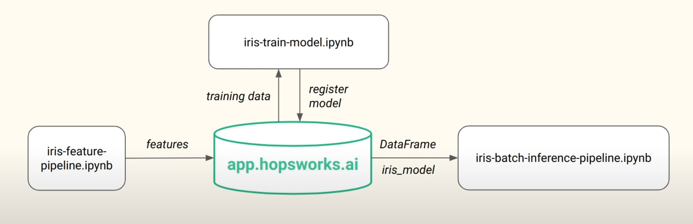
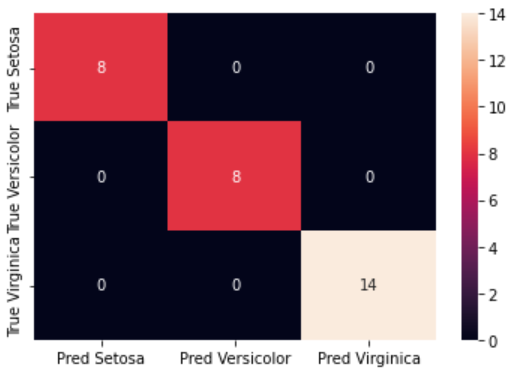
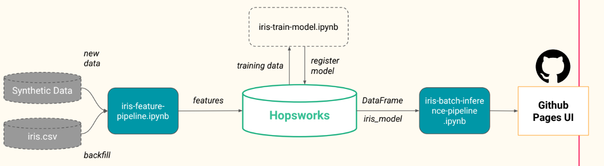

06/10/2022
# Refactoring
Our little web app in the previous article is nice but it's quite rigid in structure, very reliant on the notebook, doesn't allow for new data to be added, and can't work standalone. Let's take some steps to refactor this pipeline and deploy it in a better way.

The new architecture for the pipeline we wish to implement will look like this !
|  |
|:--:|
| <b>Fig 1. Refactored machine learning pipeline for the refactored section of the lab.</b>|

There will be three pipelines, a feature pipeline, training pipeline, and inference pipeline. Our previous notebook will be used to create features which will then be saved in a hopsworks feature store using the practices we learnt in the last lab [[Module 0 labs]]. After this, we will use the feature store to train a model in a new notebook called iris-train-model and then will register this model to hopsworks. Then, when an inference is requested, we will serve the model with hopsworks, along with the required data, to an inference notebook: iris-batch-inference-pipeline.

Production systems rarely, if ever, have static datasets. They are constantly evolving with new data being introduced all the time. This will be taken into consideration in our model by creating a synthetic data generation function that will create new iris data samples every 24 hours that will be back filled to our feature store.


## Feature pipeline
Before creating our pipeline, we install some dependencies, log in to hopsworks with our API key, and grab our feature store:
```python
!pip install -U hopsworks --quiet
import random
import pandas as pd
import hopsworks

project = hopsworks.login() #log in with API key
fs = project.get_feature_store() # collect feature store
```

We will begin by populating a feature group called 'iris' with the full iris dataset. This will all take place in the iris-feature-pipeline.ipynb. We have a toggle here called `BACKFILL` that we can set to either populate the feature group with the original iris dataset or to add new synthetic data to the feature group.

We start with `BACKFILL = True` and create a feature group and insert the df with:
```python 
iris_fg = fs.get_or_create_feature_group(name="iris",
                                  version=1,
                                  primary_key=["sepal_length","sepal_width","petal_length","petal_width"],
                                  description="Iris flower dataset"
                                 )
iris_fg.insert(iris_df)
```
Previous to this, we used pandas to read in the dataset to a df:
```python
iris_df = pd.read_csv("https://repo.hops.works/master/hopsworks-tutorials/data/iris.csv")
```

We have also written a few short functions to generate the characteristics of a single random flower and return this as a dataframe. This will come in useful when we wish to add more data to our feature group.

```python
def generate_flower(name, sepal_len_max, sepal_len_min, sepal_width_max, sepal_width_min,petal_len_max, petal_len_min, petal_width_max, petal_width_min):

    """Creates a DataFrame containing the characteristics of a single iris flower given its name

	Args:
        name (string): Name of the flower requested
        sepal_len_max (float): Max length of the sepal
        sepal_len_min (float): Min length of the sepal
        sepal_width_max (float): Max width of the sepal
        sepal_width_min (float): Min width of the sepal
        petal_len_max (float): Max length of the petal
        petal_len_min (float): Min length of the petal
        petal_width_max (float): Max width of the petal
        petal_width_min (float): Min width of the petal

    Returns:
        df (pd.DataFrame): DataFrame containing one iris flower
    """

    df = pd.DataFrame({ "sepal_length": [random.uniform(sepal_len_max, sepal_len_min)],
                       "sepal_width": [random.uniform(sepal_width_max, sepal_width_min)],
                       "petal_length": [random.uniform(petal_len_max, petal_len_min)],
                       "petal_width": [random.uniform(petal_width_max, petal_width_min)]
                      })
    df['variety'] = name
    return df

def get_random_iris_flower():
    """Returns a DataFrame containing one random iris flower
  
    Returns:
        iris_df (pd.DataFrame): DataFrame containing the random iris flower's characteristics
    """
    virginica_df = generate_flower("Virginica", 8, 5.5, 3.8, 2.2, 7, 4.5, 2.5, 1.4)
    versicolor_df = generate_flower("Versicolor", 7.5, 4.5, 3.5, 2.1, 3.1, 5.5, .8, 1.0)
    setosa_df =  generate_flower("Setosa", 6, 4.5, 4.5, 2.3, 1.2, 2, 0.7, 0.3)
    # randomly pick one of these 3 and write it to the featurestore
    pick_random = random.uniform(0,3)
    if pick_random >= 2:
        iris_df = virginica_df
    elif pick_random >= 1:
        iris_df = versicolor_df
    else:
        iris_df = setosa_df
    return iris_df
```

If we set `BACKFILL=False`  we can call this `get_random_iris_flower()` function and then set that to be the `iris_df` which will then be inserted to the feature group.

[Have a look at the notebook in my github repo here.](https://github.com/BenSnow6/serverless-ml-course/blob/main/src/01-module/iris-feature-pipeline.ipynb) 

## Training pipeline
We need to start our training pipeline by logging in to the hopsworks platform and grabbing the feature store like in the feature pipeline above. On top of this, we import some basic libraries:
```python 
from sklearn.neighbors import KNeighborsClassifier
from sklearn.metrics import accuracy_score
import pandas as pd
import seaborn as sns
import hopsworks
```
These will be used to handle the data as well as creating and evaluating our model.

### Feature view
We will now grab the feature view if we have one, in this case we don't but we will in subsequent runs of the pipeline. Since we don't have a feature view, we will create one.

```python
try:
    feature_view = fs.get_feature_view(name="iris", version=1) ## collect if exists
except:
    iris_fg = fs.get_feature_group(name="iris", version=1) # create if not exists
    query = iris_fg.select_all() # grab all features from feature group
    feature_view = fs.create_feature_view(name="iris", # name of feature view
                                      version=1, # version number
                                      description="Read from Iris flower dataset",
                                      labels=["variety"], # variety is target label
                                      query=query) # select all feaures with query
```

This will then show up in the hopsworks website.

After this is complete, we use the feature view to create a train/test split to train our model:
```python
X_train, X_test, y_train, y_test = feature_view.train_test_split(0.2, ) #80:20 tr/t
```

and create an fit a KNN model to our training data:

```python
model = KNeighboursClassifier(n_neighbours=2) # 2 nearest neighbour classifier
model.fit(X_train, y_train.values.ravel()) # fit to training data
```

After this we can create predictions on the test set, generate the classification report, and a heatmap of the confusion matrix, just like in the End to end pipeline.
|  |
|:--:|
| <b>Fig 2.Confusion matrix of trained KNN model.</b>|

Here we can see that the model predicts with 100% accuracy, but this does not indicate that the model is perfect by any means! The model is only tested on a small number of samples and we don't know if they are reflective of all possible samples we could test with.

### Registering a model on Hopsworks
Now that we have trained a model and tested it, we will register it online with hopsworks. To do this, we need to import some dependencies:
```python
from hsml.schema import Schema # creating data schema
from hsml.model_schema import ModelSchema # creating model schema
import os
import joblib # to save the model
import hopsworks
import shutil # for copying files
```

We start by grabbing the model registry, creating a directory to save everything, and saving the model as a pickle file along with the confusion matrix image:

```python
project =  hopsworks.login() # Connect to Hopsworks
mr = project.get_model_registry() # Get the model registry

# The 'iris_model' directory will be saved to the model registry
model_dir="iris_model" # The directory where the model will be saved
if os.path.isdir(model_dir) == False:
    os.mkdir(model_dir) # Create the directory if it does not exist
joblib.dump(model, model_dir + "/iris_model.pkl") # Save the model to the directory
# Copy the confusion matrix to the directory
shutil.copyfile("assets/confusion_matrix.png", model_dir + "/confusion_matrix.png") ```

We then create a schema for the input and output data along with a model schema. Also included is a small sample of the training features for our benefit:
```python
input_example = X_train.sample() # Get a sample from the training data
input_schema = Schema(X_train) # Create a schema from the feature training data
output_schema = Schema(y_train) # Create a schema from the label training data
model_schema = ModelSchema(input_schema, output_schema) # Create a model schema from the input and output schema
```

Finally, we use the model registry to save the model to hopsworks:

```python
iris_model = mr.python.create_model( # Create a model in the model registry
    version=1, # The version of the model
    name="iris",  # The name of the model
    metrics={"accuracy" : metrics['accuracy']}, # The metrics of the model
    model_schema=model_schema, # The model schema
    input_example=input_example,  # The input example of the model
    description="Iris Flower Predictor") # The description of the model

iris_model.save(model_dir) # Save the model to the model registry
```

[We can now view this in hopsworks!](https://c.app.hopsworks.ai:443/p/2289/models/iris/1) 


## Inference pipeline
We've successfully refactored our feature and training pipelines and now we're going to refactor the inference pipeline. This pipeline will take the trained model from our model registry and will allow us to query it for a prediction. We also wish to create an interface to give the user some feedback on how well the model is performing and a visual representation of the predicted image vs the ground truth image.

To start, like each other pipeline, import some useful packages, log in to hopsworks, and grab the feature store.
```python
import pandas as pd
import hopsworks
import joblib
  
project = hopsworks.login()
fs = project.get_feature_store()
```

To make an inference, we must get the model from our model registry. We can do this by grabbing the model registry, getting a reference to the model, downloading it, then loading it into memory:
```python
mr = project.get_model_registry() # Get the model registry
model = mr.get_model(name="iris", version=1) # Get the model from the model registry
model_dir = model.download() # Download the model to the local directory
model = joblib.load(model_dir + "/iris_model.pkl") # Load the model
```

Next, we want to access our feature view and download a batch of data from it. If we just call `get_batch_data` on the feature view, we will be returned the entire dataset. Let's start with that:
```python
feature_view = fs.get_feature_view(name="iris", version=1) # Get the feature view
batch_data = feature_view.get_batch_data() # Get the batch data from the feature view
y_pred = model.predict(batch_data) # Predict on the batch data
```

Here we have created predictions for the entire feature view. We're interested in the most recent prediction so will use `y_pred[y_pred.size-1]` to access it.

We want to show the user the predicted flower from the model so will use this last prediction to access the image from our local directory:
```python
flower = y_pred[y_pred.size-1] # Get the last prediction
flower_img = "assets/" + flower + ".png" # Get the image path
img = Image.open(flower_img) # Open the image
img.save("../../assets/latest_iris.png") # Save the image as the latest prediction
```
In order to get the **actual** flower, we need to access the feature group and get the last row of data. We can do this by getting the feature group 'iris' and reading it into a dataframe. Then, if we access the last row of the dataframe, we can get the label by querying the "variety" column:

```python
iris_fg = fs.get_feature_group(name="iris", version=1) # Get the feature group
df = iris_fg.read() # Read the feature group into a dataframe
label = df.iloc[-1]["variety"] # Get the label of the last row
```
Now we can grab the image associated to the actual flower and save this to our directory too:

```python
label_flower = "assets/" + label + ".png" # Get the image path
img = Image.open(label_flower) # Open the image
img.save("../../assets/actual_iris.png") # Save the image as the actual flower
```

With that done, we can now save our predictions to a new feature group that we can use to **monitor** our predictions. This is useful for investigating how our deployed model is performing. To make this more informative, we can add some metadata that will be saved with the predictions. We will add the prediction itself, the ground truth label, and the time of the prediction. We can do this by creating a dictionary and inserting it into the new feature group:
```python
# Get or create the feature group
monitor_fg = fs.get_or_create_feature_group(name="iris_predictions",
                                  version=1,
                                  primary_key=["datetime"], # Set the primary key
                                  description="Iris flower Prediction/Outcome Monitoring"
                                 )

# create the metadata
from datetime import datetime
now = datetime.now().strftime("%m/%d/%Y, %H:%M:%S") # Get the current time
metadata = {
    'prediction': [flower], # The prediction
    'label': [label], # The ground truth label
    'datetime': [now], # The time of the prediction
}
monitor_df = pd.DataFrame(metadata) # Create a dataframe from the metadata
monitor_fg.insert(monitor_df) # insert into our monitoring feature group
```

We can easily access this feature group by calling `.read()` on it and can then use this to create some plots to show the user how well the model is performing. A confusion matrix of the predictions for the last five elements of the feature group is performed and a snapshot of the dataframe itself will be saved and shown to the user.

```python
history_df = monitor_fg.read() # Read the monitoring feature group into a dataframe
import dataframe_image as dfi # for dataframe snapshot
df_recent = history_df.tail(5) # Get the last 5 predictions
dfi.export(df_recent, "../../assets/df_recent.png") # Save the dataframe as an image
```

In order to create a confusion matrix, we need at least three predictions, one from each class. Therefore, we will run the feature pipeline two more times to get some more synthetic data. Ensure that `BACKFILL` is set to `False` in the feature pipeline.

Now that we have some more data, we can create a confusion matrix and save it to our directory:
```python
from sklearn.metrics import confusion_matrix

predictions = history_df[['prediction']] # Get the predictions
labels = history_df[['label']] # Get the labels
results = confusion_matrix(labels, predictions)	# Create the confusion matrix

# Only create the confusion matrix when our iris_predictions feature group has examples of all 3 iris flowers
if results.shape == (3,3):
    df_cm = pd.DataFrame(results, ['True Setosa', 'True Versicolor', 'True Virginica'],
                         ['Pred Setosa', 'Pred Versicolor', 'Pred Virginica']) # Create a dataframe from the confusion matrix
    cm = sns.heatmap(df_cm, annot=True) # Create a heatmap from the dataframe
    fig = cm.get_figure() # Get the figure
    fig.savefig("../../assets/confusion_matrix.png") # Save the figure
    df_cm # Show the dataframe
else:
    print("Run the batch inference pipeline more times until you get 3 different iris flowers") # run feature pipeline more times to get more data
```

We now have all the pieces of the puzzle to create our serverless application!!! We just need a way to automate these steps so that it can run on its own. To do this, we will use Github Actions.

## GitHub Actions

Our pipleline from now on will be as follows:
|  |
|:--:|
| <b>Fig 3. Our three pipelines and deployment to GitHub pages.</b>|

Our main dataset, the iris.csv, is used to backfill the "iris" feature group and is called only once to initially populate our feature store. Synthetic data is produced by our feature pipeline with the `get_random_iris_flower()` function and will be run once per day. The feature pipeline then inserts the new synthetic data to the "iris" feature group.

Next, the training pipeline will take the training data from the feature group by creating a feature view and will train a KNN model on this data. The model will then be evaluated and evaluation metrics, along with the model itself, will be stored in the model registry on Hopsworks.

Finally, the batch inference pipeline will allow us to make predictions on the latest batch of data from the "iris" feature group. The predictions will be saved to a new feature group that we can use to monitor our model. We will also save the confusion matrix and a snapshot of the monitoring feature group to our directory so that we can show the user how well the model is performing. Along with this, the current prediction and the actual flower will be saved as images so that we can show the user what the model predicted and what the actual flower was.

All of these events will be scheduled by Github Actions. and the results will be shown on a github-pages site.

Before we can use Github Actions, we must save our Hopswork API key in the *secrets* section of Github. How enigmatic ;) On the topic of enigmas... We will continue with the automatic deployment of our serverless application on Github Pages in the next post. Stay tuned!